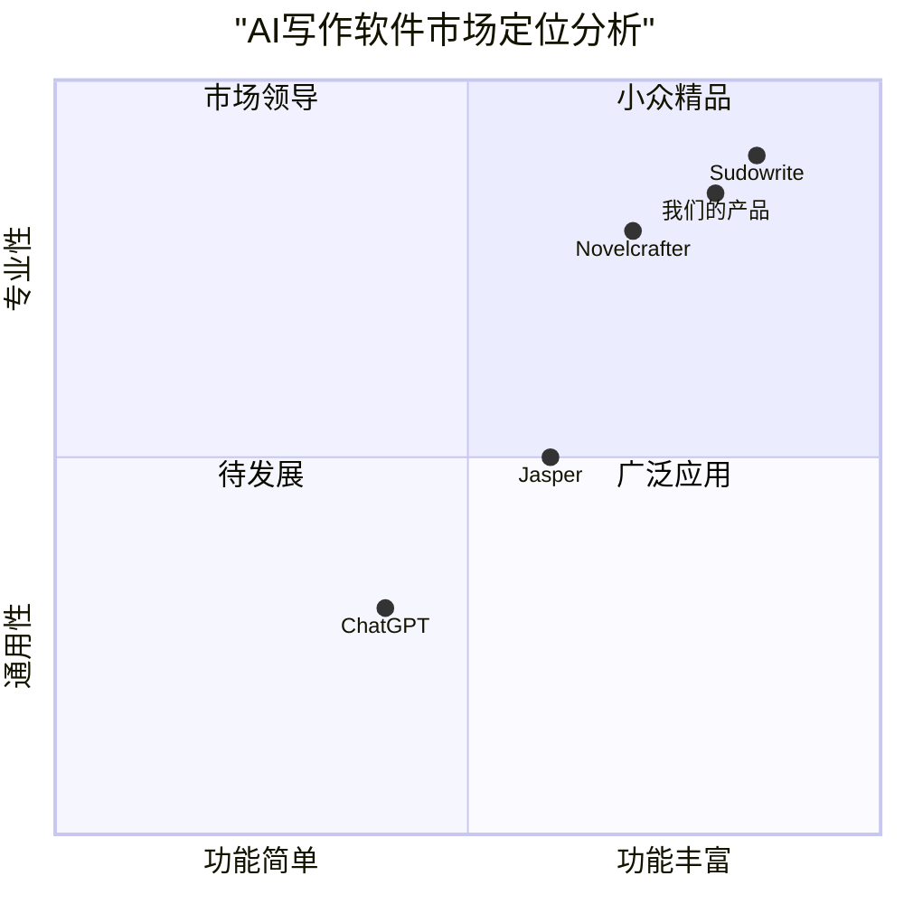
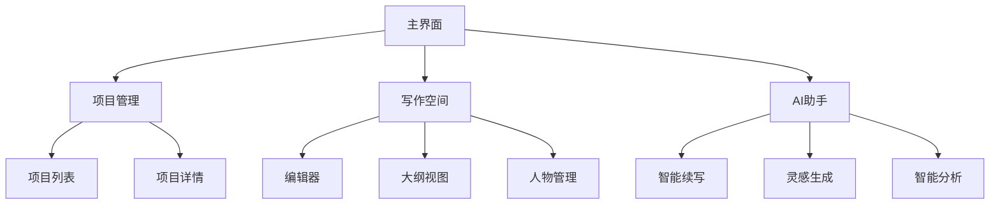

# AI小说创作助手产品需求文档（PRD）

## 1. 项目概述

### 1.1 项目背景

AI技术的快速发展为创意写作带来了新的机遇。随着全球AI写作软件市场规模在2024年达到15.2亿美元，并预计到2032年增长至99.5亿美元（CAGR 26.48%），我们希望通过打造一个专业的AI小说创作平台，解决作家在创作过程中面临的效率和质量问题。

### 1.2 项目目标

1. 提供一站式小说创作解决方案，覆盖从构思到成稿的全生命周期
2. 通过AI技术提升写作效率，降低创作门槛
3. 打造智能化的写作助手，实现与作者的深度协作

### 1.3 用户故事

1. 作为一个新手作家，我希望能够通过AI辅助快速构建人物和故事框架，这样我可以更容易地开始我的创作之旅
2. 作为一个职业作家，我需要一个智能系统帮我管理庞大的故事世界和人物关系，以保持故事的连贯性
3. 作为一个业余写作爱好者，我想要在写作过程中获得及时的反馈和建议，以提升我的写作水平
4. 作为一个连载小说作者，我需要系统能够帮我追踪和管理已发布的情节，避免前后矛盾

### 1.4 竞品分析

#### 竞品优劣势分析：

1. Novelcrafter
   - 优势：
     * 完善的组织工具
     * 灵活的AI集成
     * 简洁的界面
   - 劣势：
     * 需要外部API密钥
     * 格式化选项有限
     * 学习曲线较陡
     * 本地运算性能差

2. Sudowrite
   - 优势：
     * 专业的创意写作功能
     * 优秀的描写生成能力
     * 可学习作者风格
   - 劣势：
     * 缺乏抄袭检查
     * 部分功能实验性质
     * 操作复杂

## 2. 功能需求

### 2.1 核心功能

#### P0（必须实现）

1. 项目管理
   - 创建/编辑/删除项目
   - 章节管理
   - 版本控制

2. 内容编辑
   - 富文本编辑器
   - 自动保存
   - 历史记录

3. 人物管理
   - 人物信息卡
   - 关系图谱
   - AI辅助人物设计

4. 情节管理
   - 大纲编辑
   - 时间线视图
   - 剧情预览

5. AI创作助手
   - 智能续写
   - 情节建议
   - 人物对话生成

#### P1（重要）

1. 知识库检索
   - 已有内容检索
   - 智能关联推荐
   - 矛盾检测

2. 智能分析
   - 情节节奏分析
   - 人物特征分析
   - 写作风格分析

#### P2（待考虑）

1. 协作功能
   - 多人协作
   - 评论系统
   - 权限管理

2. 导出功能
   - 多格式导出
   - 自定义模板
   - 排版优化

### 2.2 技术需求

1. 前端技术栈
   - React/Next.js
   - TailwindCSS
   - 响应式设计

2. 后端要求
   - 分布式架构
   - 高并发支持
   - 数据安全保护

3. AI模型集成
   - 支持主流大语言模型
   - 支持自定义提示词
   - 上下文管理

## 3. 界面设计

### 3.1 整体布局

### 3.2 主要页面功能

1. 项目管理页
   - 项目卡片展示
   - 快速访问入口
   - 项目统计信息

2. 写作页面
   - 分屏编辑
   - 大纲导航
   - 工具栏
   - AI助手侧边栏

3. 人物管理页
   - 人物列表
   - 详细信息卡
   - 关系图谱

## 4. 开放问题

1. AI模型选择
   - 是否需要支持多个AI模型?
   - 如何处理不同模型的特点差异?

2. 数据安全
   - 如何保护用户的创作内容?
   - 是否需要端到端加密?

3. 性能优化
   - 如何处理长文本的实时保存?
   - 如何优化AI响应速度?

4. 商业模式
   - 采用订阅制还是一次性购买?
   - 如何设计合理的定价策略?

## 5. 开发规划

### 第一阶段（MVP）
- 基础项目管理
- 核心编辑功能
- 简单AI续写

### 第二阶段
- 完整人物管理
- 高级AI功能
- 知识库检索

### 第三阶段
- 协作功能
- 高级分析
- 性能优化
