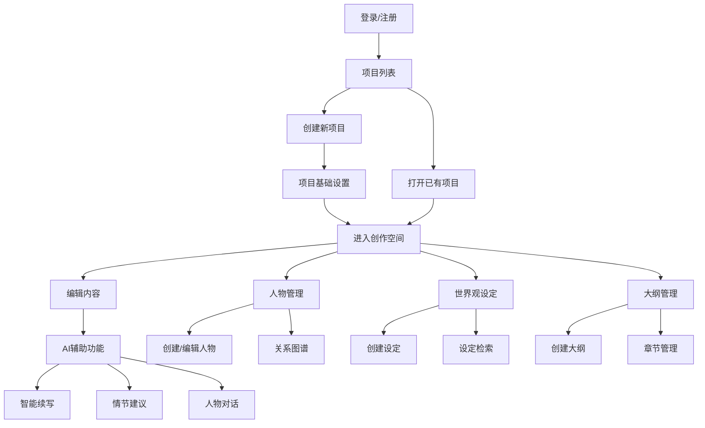
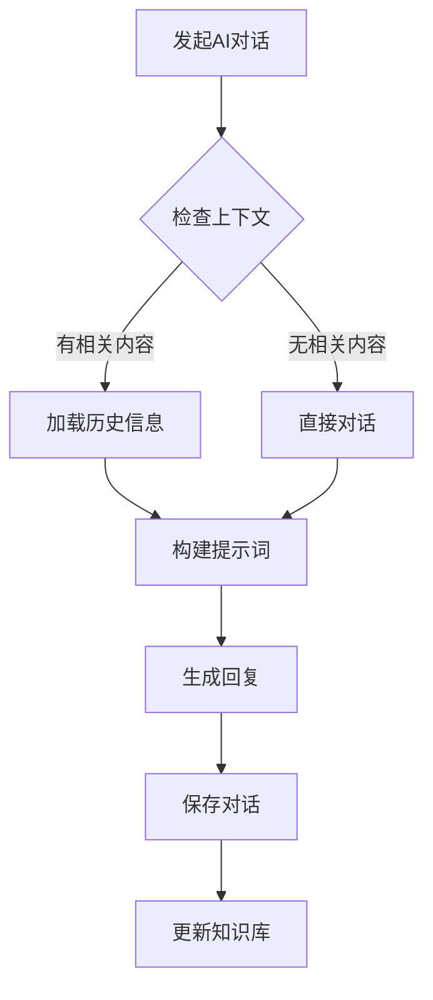

# AI小说创作助手用户流程与界面设计

## 1. 用户流程图

### 1.1 主要用户流程



### 1.2 AI对话流程



## 2. 界面原型设计

### 2.1 登录注册页面

```
+----------------------------------+
|           AI创作助手             |
|                                  |
|  +----------------------------+  |
|  |         Logo              |  |
|  +----------------------------+  |
|                                  |
|  +----------------------------+  |
|  |    邮箱/用户名            |  |
|  +----------------------------+  |
|                                  |
|  +----------------------------+  |
|  |      密码                 |  |
|  +----------------------------+  |
|                                  |
|  +----------------------------+  |
|  |      登录                 |  |
|  +----------------------------+  |
|                                  |
|  还没有账号？立即注册          |
+----------------------------------+
```

### 2.2 项目列表页面

```
+----------------------------------+
|  导航栏                          |
+----------------------------------+
|                                  |
|  +--------+  +--------+         |
|  |新建项目|  |项目排序|         |
|  +--------+  +--------+         |
|                                  |
|  项目列表：                     |
|  +----------------------------+  |
|  | 项目1                      |  |
|  | - 最后编辑时间             |  |
|  | - 字数统计                 |  |
|  +----------------------------+  |
|                                  |
|  +----------------------------+  |
|  | 项目2                      |  |
|  | - 最后编辑时间             |  |
|  | - 字数统计                 |  |
|  +----------------------------+  |
|                                  |
+----------------------------------+
```

### 2.3 创作空间页面

```
+----------------------------------+
|  导航栏     项目名称    设置     |
+----------------------------------+
|                      |           |
| 大纲树              | AI助手    |
| +-章节1            |           |
| +-章节2            |  对话框   |
| | +-场景1          |           |
| | +-场景2          |           |
|                      |           |
|---------------------|           |
|                      |           |
| 编辑区域            |           |
|                      |           |
| 富文本编辑器        |           |
|                      |           |
|                      |           |
+----------------------------------+
```

### 2.4 人物管理页面

```
+----------------------------------+
|  导航栏                          |
+----------------------------------+
|  人物列表  |  人物详情          |
|            |                     |
|  +主角     |  基本信息：        |
|  +配角     |  姓名：            |
|  +反派     |  年龄：            |
|            |  性别：            |
|            |  性格特征：        |
|            |                     |
|            |  背景故事：        |
|            |  ................   |
|            |                     |
|            |  关系图谱：        |
|            |  [关系图显示区域]  |
|            |                     |
+----------------------------------+
```

### 2.5 AI对话界面

```
+----------------------------------+
|  AI助手                          |
+----------------------------------+
|                                  |
|  [对话历史显示区域]             |
|                                  |
|  用户: 帮我完善这个情节         |
|                                  |
|  AI: 根据当前上下文，我建议...  |
|                                  |
|  +----------------------------+  |
|  |                            |  |
|  | 输入框                     |  |
|  |                            |  |
|  +----------------------------+  |
|                                  |
|  快捷操作：                     |
|  [续写] [修改] [分析] [建议]   |
|                                  |
+----------------------------------+
```

## 3. 交互说明

### 3.1 通用交互原则

1. 自动保存
   - 编辑内容时自动保存
   - 显示最后保存时间
   - 保存状态指示器

2. 快捷键支持
   - Ctrl + S：手动保存
   - Ctrl + Z：撤销
   - Ctrl + Y：重做
   - Ctrl + F：搜索
   - Ctrl + Space：唤起AI助手

3. 拖拽操作
   - 大纲树节点可拖拽排序
   - 分屏区域可调整大小
   - 人物关系图可拖拽调整

### 3.2 AI助手交互

1. 上下文感知
   - 自动检测当前编辑位置
   - 智能加载相关内容
   - 显示参考来源

2. 提示词模板
   - 预设常用提示词
   - 自定义提示词
   - 提示词收藏

3. 结果处理
   - 一键插入
   - 编辑后插入
   - 放弃生成

### 3.3 编辑器功能

1. 格式化工具
   - 文本格式（粗体、斜体、下划线）
   - 段落格式（缩进、对齐）
   - 标题层级

2. 内容组织
   - 章节折叠
   - 大纲导航
   - 快速跳转

3. 版本控制
   - 历史版本列表
   - 版本对比
   - 版本回滚

## 4. 响应式设计

1. 桌面端（>= 1024px）
   - 完整三栏布局
   - 全功能支持

2. 平板端（>= 768px）
   - 两栏布局
   - 可切换显示区域

3. 移动端（< 768px）
   - 单栏布局
   - 抽屉式菜单
   - 简化功能